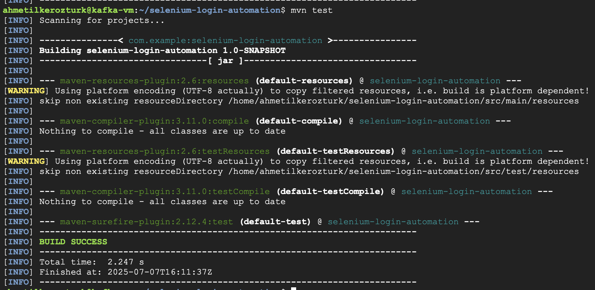
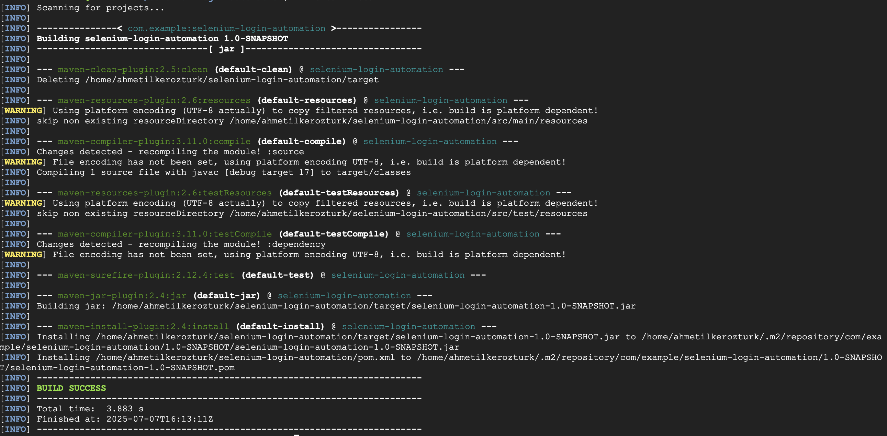

# Selenium Java Login Automation – E-commerce Website

This project demonstrates a simple Selenium Java automation for logging into an e-commerce website.

## 🚀 Steps

### 1. Project Setup

- Created a new Maven Java project for Selenium automation.
- Installed required dependencies (`selenium-java`, etc.).
- Downloaded the compatible [ChromeDriver](https://googlechromelabs.github.io/chrome-for-testing/) for my Chrome version.
- Placed the `chromedriver` binary into `/usr/local/bin/`.

**Screenshot:**  


---

### 2. Writing the Selenium Login Test

- Wrote a simple Selenium test script in Java to:
    - Open the e-commerce website
    - Navigate to the login page
    - Enter the username and password
    - Submit the login form
    - (Optionally) check if login was successful

**Example Java Code:**
```java
import org.openqa.selenium.By;
import org.openqa.selenium.WebDriver;
import org.openqa.selenium.chrome.ChromeDriver;

public class LoginTest {
    public static void main(String[] args) {
        System.setProperty("webdriver.chrome.driver", "/usr/local/bin/chromedriver");
        WebDriver driver = new ChromeDriver();
        driver.get("https://example-ecommerce.com/login"); // Replace with actual login URL

        driver.findElement(By.id("username")).sendKeys("your_username");
        driver.findElement(By.id("password")).sendKeys("your_password");
        driver.findElement(By.id("login-button")).click();

        // Optionally, add assertions/checks

        driver.quit();
    }
}
```

**Screenshot:**  


---

### 3. Running and Verifying the Test

- Ran the test in the terminal.
- Selenium launched Chrome and automated the login.
- Test completed successfully and browser closed.

**Screenshot:**  


---

## 📝 Summary

- Set up a Maven Selenium project
- Downloaded and configured ChromeDriver
- Wrote and ran a login automation test
- Added relevant screenshots

---

## 📸 Screenshots

Screenshots are placed inside the `/screenshots` folder and referenced in the steps above.

---

