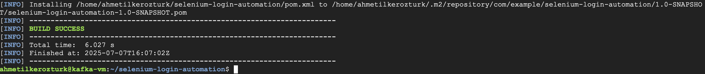

# 🛒 Selenium Java Automation – E-commerce Login Test

This project demonstrates how to automate the login process of an e-commerce website using Selenium WebDriver in Java.

---

## 🚀 What I Did

- **Created a Maven-based Java project**
- **Added Selenium dependency to `pom.xml`**
- **Downloaded and configured ChromeDriver matching my Chrome version**
- **Wrote a test code to:**
  - Open the e-commerce website
  - Enter username & password
  - Click the login button
- **Ran the automation and verified login**
- **Captured screenshots of each step**

---

## 📸 Screenshots

### 1. Project Setup



---

### 2. Example Test Code

```java
WebDriver driver = new ChromeDriver();
driver.get("https://example-ecommerce.com/login");
driver.findElement(By.id("username")).sendKeys("yourUsername");
driver.findElement(By.id("password")).sendKeys("yourPassword");
driver.findElement(By.id("loginButton")).click();
